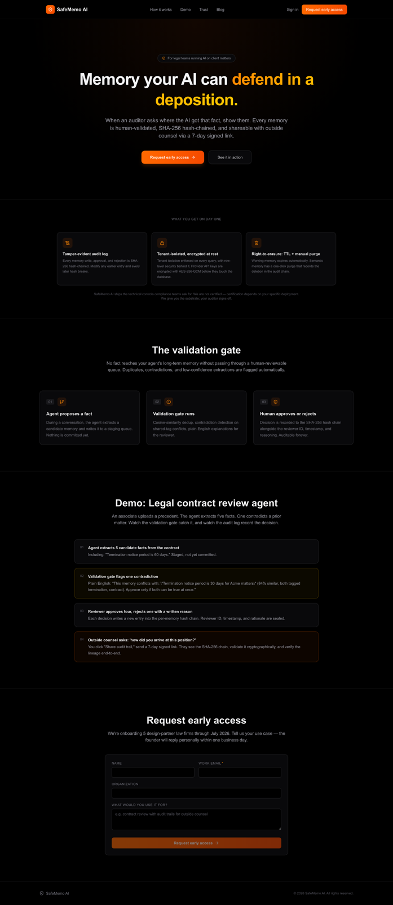
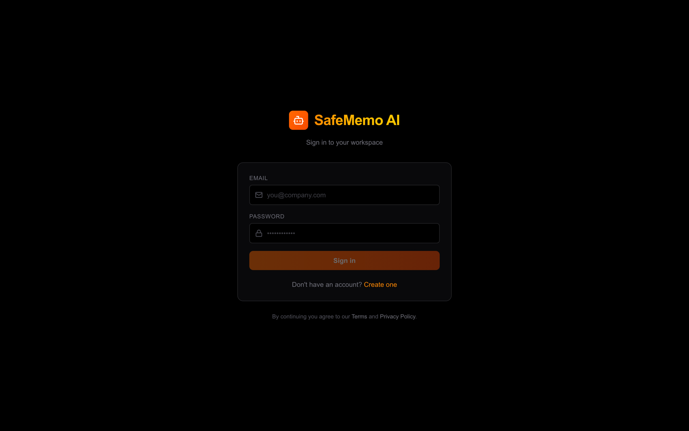
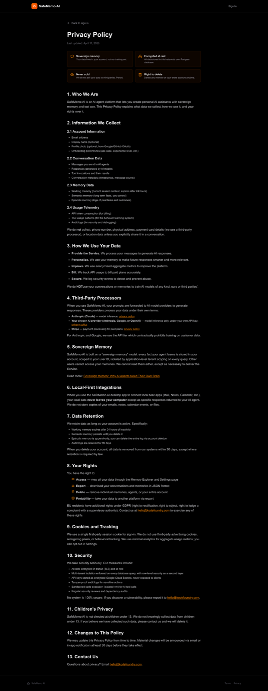

# SafeMemo AI

**Auditable memory for AI agents. Self-hosted, bring your own model key.**

Most agent memory is a vector database with no provenance: a fact goes in, and
later it comes out, and nobody can say who approved it or when. SafeMemo AI
puts a human validation gate in front of long-term memory and records every
decision in a SHA-256 hash chain, so "where did the AI get that?" has an
answer you can hand to an auditor.

Everything runs on your own infrastructure. There is no hosted service, no
shared model key, and no vendor holding your data.



---

## How it works

```
  agent proposes a fact
          │
          ▼
  ┌───────────────────┐     staged, not yet real
  │  staging_memories │────────────────────────────┐
  └───────────────────┘                            │
          │                                        │
          │  validation gate: vector dedup,        │
          │  contradiction check, confidence       │
          ▼                                        │
  ┌───────────────────┐                            │
  │  human approves   │                            │
  │  or rejects       │                            │
  └───────────────────┘                            │
          │                                        │
          ▼                                        ▼
  ┌───────────────────┐              ┌────────────────────────┐
  │ semantic_memories │              │  audit_logs            │
  │ (agent can read)  │              │  SHA-256 hash chain,   │
  └───────────────────┘              │  append-only by        │
                                     │  database trigger      │
                                     └────────────────────────┘
```

Three layers of memory, following the usual cognitive split:

| Layer | Table | What it holds |
|---|---|---|
| L1 working | `messages` | Recent turns, replayed into the prompt for continuity |
| L2 semantic | `semantic_memories` | Durable facts — **only reachable through the validation gate** |
| L3 episodic | `episodic_memories` | One record per completed agent run |

The chain is the point. Each audit entry hashes the previous entry's hash
together with a canonical encoding of its own contents, so editing any earlier
row invalidates every hash after it. `UPDATE` and `DELETE` on `audit_logs` are
blocked by a database trigger, not by convention.

---

## Bring your own key

SafeMemo AI ships with **no model API key**. Each user supplies their own
Anthropic, Google, or OpenAI key after signing up, and is billed by that
provider directly.



Keys are protected with envelope encryption:

```
plaintext API key  ──sealed under──▶  DEK  (random, one per credential)
DEK                ──sealed under──▶  MASTER_ENCRYPTION_KEY (env only)
```

Both layers are AES-256-GCM. The additional authenticated data binds each
ciphertext to `(credentialId, userId, provider)`, so a credential row copied
into another user's record fails the authentication tag rather than
decrypting — a database-write bug cannot become "spend someone else's quota".

Other properties worth knowing:

- **There is no endpoint that reads a key back.** Not for the user, not for an
  administrator. Only the last four characters are ever displayed.
- **Keys are verified before storage.** Saving one makes a live call to the
  provider, so an unusable key never reaches the database.
- **Rotation is cheap.** Only the wrapped DEK is rewritten, never the API-key
  ciphertext, and `npm run rotate-master-key` is resumable.
- Decryption failures return a uniform error; the specific cause goes to the
  server log only, so there is no oracle to probe.

---

## Tech stack

| Layer | Choice | Why |
|---|---|---|
| API | Node 20, Express, TypeScript (strict) | Small surface, no framework lock-in |
| Database | PostgreSQL 16 + [pgvector](https://github.com/pgvector/pgvector) | Relational data and vector search in one place; no separate vector DB to operate |
| Vector index | HNSW, cosine distance, 768 dimensions | Matches both the local model and Gemini's `text-embedding-004` |
| Embeddings | ONNX `bge-base-en-v1.5` in-process (default) | No API key, no per-call cost, and memory content never leaves the machine |
| Auth | Argon2id passwords, opaque session cookies | Only the SHA-256 of a session token is stored, so a database dump yields no replayable sessions |
| Encryption | AES-256-GCM envelope, Node `crypto` | No third-party crypto dependency |
| Frontend | Next.js 16 (App Router), React 19, Tailwind 4 | — |
| Streaming | Server-Sent Events | Tokens arrive on the same request that sent the message |
| Agent loop | `@anthropic-ai/sdk`, tool use | One streamed call per turn |
| Packaging | Docker Compose | `docker compose up` and you have the whole system |

**No Firebase, no Google Cloud, no managed services.** The only outbound calls
are to the AI provider whose key the user supplied.

---

## Quick start

Requirements: Docker, and an API key from
[Anthropic](https://console.anthropic.com/settings/keys),
[Google](https://aistudio.google.com/apikey), or
[OpenAI](https://platform.openai.com/api-keys).

```bash
git clone https://github.com/josephhamawi/safememo-ai.git
cd safememo-ai
cp .env.example .env
```

Fill in the four required secrets:

```bash
# Back MASTER_ENCRYPTION_KEY up somewhere other than this server. Losing it
# makes every stored provider credential permanently unreadable.
openssl rand -base64 32   # → MASTER_ENCRYPTION_KEY
openssl rand -hex 32      # → SESSION_SECRET
openssl rand -hex 48      # → AUDIT_SHARE_SECRET
                          # → POSTGRES_PASSWORD (anything strong)
```

Then:

```bash
docker compose up -d db
cd server && npm install && npm run migrate
docker compose up -d

cd ../web && npm install && npm run dev
```

Open <http://localhost:3000>, create an account, and the app takes you
straight to key setup — nothing works until a provider key is connected,
which is deliberate.

### Configuration

Every value is documented in [`.env.example`](.env.example). The ones that
change behaviour most:

| Variable | Default | Notes |
|---|---|---|
| `EMBEDDING_PROVIDER` | `local` | `local`, `google` (BYOK), or `none` |
| `SIGNUP_MODE` | `open` | `open`, `invite`, or `closed` |
| `DAILY_REQUEST_LIMIT` | `2000` | Guards this server's resources, **not** spend — under BYOK the user is billed by their provider |
| `APP_ORIGIN` | `http://localhost:3000` | Exact origin, no wildcards |

> **Intel Mac note:** `onnxruntime-node` ships no `darwin/x64` binary, so the
> local embedding backend cannot load there. It degrades to lexical search
> with a loud log line rather than failing to boot. Run in Docker, or set
> `EMBEDDING_PROVIDER=google`.

---

## Data ownership



- **Export.** `GET /memories/export` returns every memory as JSON.
- **Erasure.** Purging a memory clears its content and drops its embedding,
  while the audit chain keeps the record *that a deletion happened* — erasing
  the content without erasing the evidence of the erasure.
- **Share.** A signed, expiring link lets an auditor verify one memory's chain
  without an account. Links are HMAC-signed *and* row-backed, so a single link
  can be revoked without invalidating everyone else's.

---

## Project layout

```
server/                 API, agent loop, crypto, migrations
  src/crypto/           envelope encryption + master-key rotation
  src/agents/           tool-use loop, memory context, tools
  src/embeddings/       local ONNX and BYOK Gemini backends
  src/routes/           HTTP surface
  src/db/migrations/    forward-only SQL
web/                    Next.js frontend
desktop-app/            Electron wrapper (optional)
desktop-mcp/            local MCP server for Mac apps (optional)
docs/screenshots/       images used by this README
```

## Development

```bash
cd server
npm test           # unit tests; integration tests skip without a database
npm run typecheck

# Integration suite — needs a real Postgres with pgvector
docker compose up -d db
TEST_DATABASE_URL=postgres://safememo:<password>@localhost:5432/safememo npm test
```

---

## Status

Early and honest about it:

- The agent loop currently supports **Anthropic only**. Google and OpenAI keys
  store and verify correctly, but `runAgent` will refuse them.
- Custom MCP server registration is not yet in the self-hosted backend, so the
  desktop app's auto-registration is a documented no-op.
- Conversation deletion has no endpoint yet.

Contributions welcome — see [CONTRIBUTING.md](CONTRIBUTING.md). Security
reports: [SECURITY.md](SECURITY.md).

## License

[AGPL-3.0](LICENSE).
